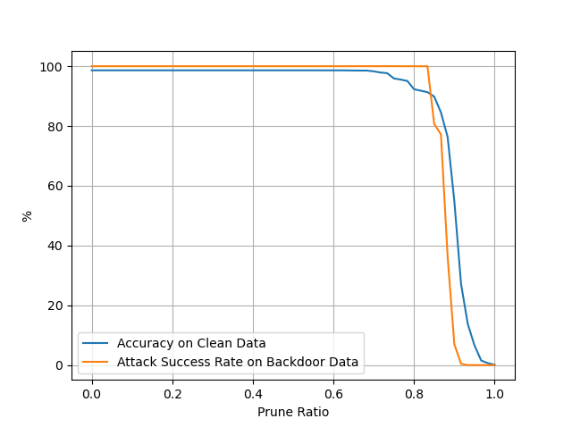

# Lab 3



```bash
├── data 
    └── cl
        └── valid.h5 // this is clean validation data used to design the defense
        └── test.h5  // this is clean test data used to evaluate the BadNet
    └── bd
        └── bd_valid.h5 // this is sunglasses poisoned validation data
        └── bd_test.h5  // this is sunglasses poisoned test data
├── models
    └── bd_net.h5
    └── bd_weights.h5
    └── repair_net_two_percent.h5
    └── repair_net_four_percent.h5
    └── repair_net_ten_percent.h5
├── architecture.py
└── eval.py // this is the evaluation script
```

## I. Dependencies
   1. Python 3.6.9
   2. Keras 2.3.1
   3. Numpy 1.16.3
   4. Matplotlib 2.2.2
   5. H5py 2.9.0
   6. TensorFlow-gpu 1.15.2
   
## II. Data
   1. Download the validation and test datasets from [here](https://drive.google.com/drive/folders/1Rs68uH8Xqa4j6UxG53wzD0uyI8347dSq?usp=sharing) and store them under `data/` directory.
   2. The dataset contains images from YouTube Aligned Face Dataset. We retrieve 1283 individuals and split into validation and test datasets.
   3. bd_valid.h5 and bd_test.h5 contains validation and test images with sunglasses trigger respectively, that activates the backdoor for bd_net.h5. 

## III. Models
   1. Download the models from [here](https://drive.google.com/drive/folders/1Wpd4V7Uaw5yBfJ6PytUx3a4A6Fp2YayR?usp=sharing)

## IV. Evaluating the Backdoored Model
   1. The DNN architecture used to train the face recognition model is the state-of-the-art DeepID network. 
   2. To evaluate the backdoored model, execute `eval.py` by running:  
      `python3 eval.py --bd_model <backdoor model path> --repair_model <repaired model path> --val_data <validation data path> --backdoor_data <backdoor data path>`.
      
      E.g., `python3 eval.py --bd_model models/bd_net.h5 --repair_model models/repair_net_two_percent.h5 --val_data data/cl/valid.h5 --backdoor_data data/bd/bd_valid.h5`. This will output:
      Clean Classification accuracy: 95.75 %
      Attack Success Rate: 100 %

## V. Important Notes
Please use only clean validation data (valid.h5) to design the pruning defense. And use test data (test.h5 and bd_test.h5) to evaluate the models. 
